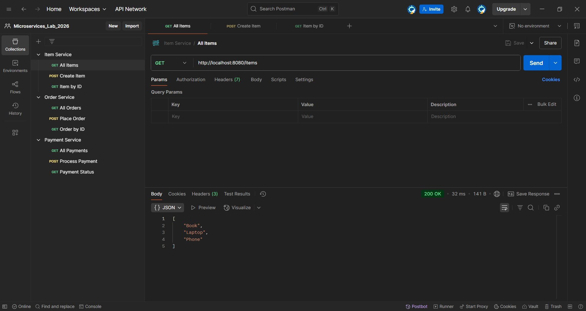
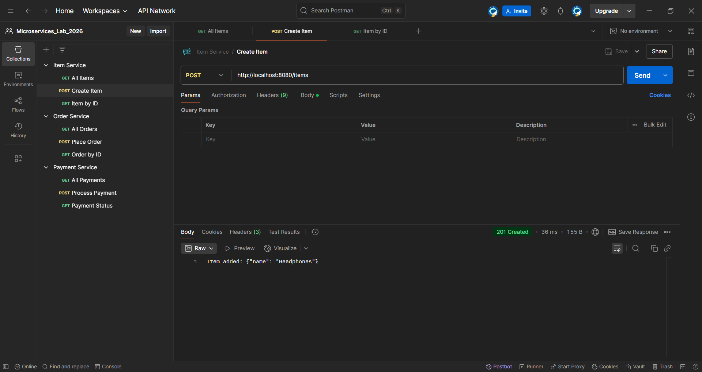
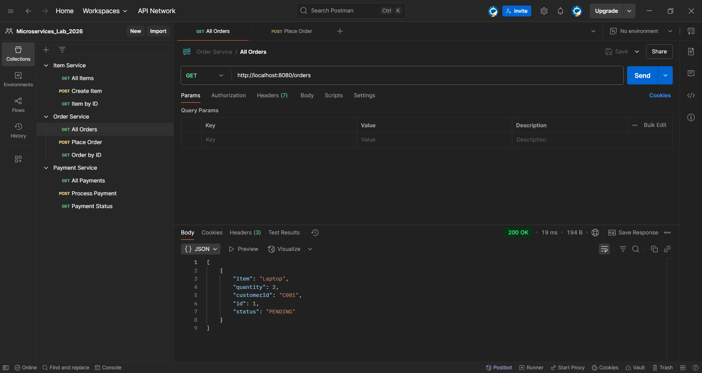
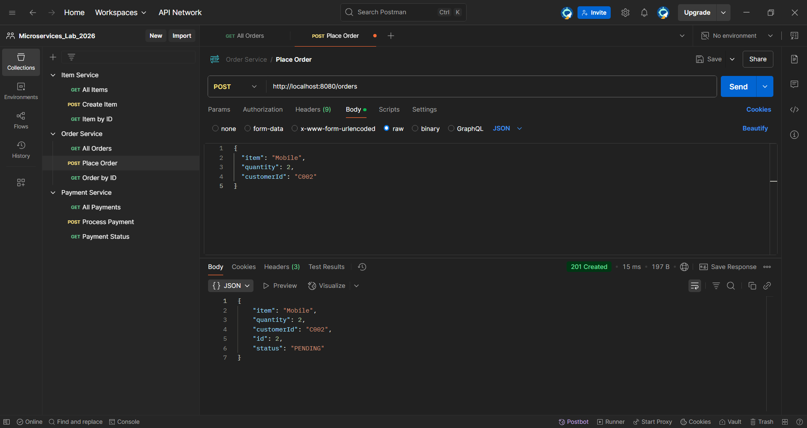
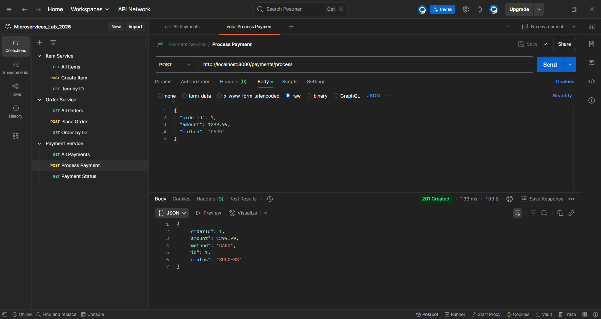

# 🚀 Microservices Lab: Spring Boot & Docker Containerization
### Module: Current Trends in Software Engineering (SE4010) - 2026

---

## 📖 Project Overview
This repository contains the practical implementation of a **Microservices Architecture** using **Spring Boot 3.2.0**. The lab focuses on building independent services for Item, Order, and Payment management, routing them through a centralized **API Gateway**, and orchestrating the entire ecosystem using **Docker Compose**.

### ✨ Key Features
* **Service Independence**: Four separate Spring Boot applications running in isolated containers.
* **API Gateway Routing**: Centralized entry point on port `8080` using Spring Cloud Gateway.
* **Container Orchestration**: Using `docker-compose` to manage networking and service dependencies.
* **Bonus Implementation**: Full support for POST methods to demonstrate data handling across microservices.

---

## 🛠 Tech Stack
| Technology | Usage |
| :--- | :--- |
| **Java 17** | Application Runtime |
| **Spring Boot 3.2.0** | Microservices Framework |
| **Spring Cloud Gateway** | API Gateway & Routing |
| **Docker & Compose** | Containerization & Orchestration |
| **Maven Wrapper** | Dependency Management |

---

## 📂 Project Structure
```text
Microservices_Lab_2026/
├── api-gateway/        # Port 8080: Routing & Entry Point
├── item-service/       # Port 8081: Item Inventory 
├── order-service/      # Port 8082: Order Management
├── payment-service/    # Port 8083: Payment Processing
└── docker-compose.yml  # Orchestration configuration
```

## 🚀 Execution & Evidence

### 1. Build and Package
Generated executable JAR files for each service using the Maven wrapper to ensure environment consistency.
* **Command:** `.\mvnw clean package` (Executed in each service folder)

### 2. Start the Microservices
From the root directory (where `docker-compose.yml` is located), run the following command in PowerShell to build and start all containers:
```powershell
docker-compose up --build
```

## 🧪 API Testing & Evidence (via Gateway - Port 8080)
All services are accessible through the centralized API Gateway.

### 1. Item Service
* **GET** `http://localhost:8080/items` - Retrieve all items.
> **Evidence:** 
* **POST** `http://localhost:8080/items` - Add a new item (Bonus Requirement).
> **Evidence:** 

### 2. Order Service
* **GET** `http://localhost:8080/orders` - View all orders.
> **Evidence:** 
* **POST** `http://localhost:8080/orders` - Place a new order (Bonus Requirement).
> **Evidence:** 

### 3. Payment Service
* **POST** `http://localhost:8080/payments/process` - Process a payment (Bonus Requirement).
> **Evidence:** 
* **GET** `http://localhost:8080/payments/1` - Check payment status.
> **Evidence:** 

---

## 📋 Docker & Spring Commands Used
| Category | Command | Description |
| :--- | :--- | :--- |
| **Maven** | `.\mvnw clean install -U` | Force update dependencies |
| **Docker** | `docker-compose build` | Build images from Dockerfiles |
| **Docker** | `docker-compose up` | Start all microservices |
| **Docker** | `docker-compose down` | Stop and remove all containers |

---

## ✍️ Student Information
* **Name:** Nithika Perera
* **IT Number:** IT22061348
* **Specialization:** Software Engineering
* **Module:** Current Trends in Software Engineering (SE4010)
* **Institute:** SLIIT - Faculty of Computing
